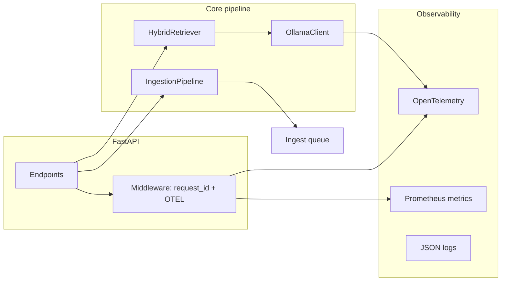
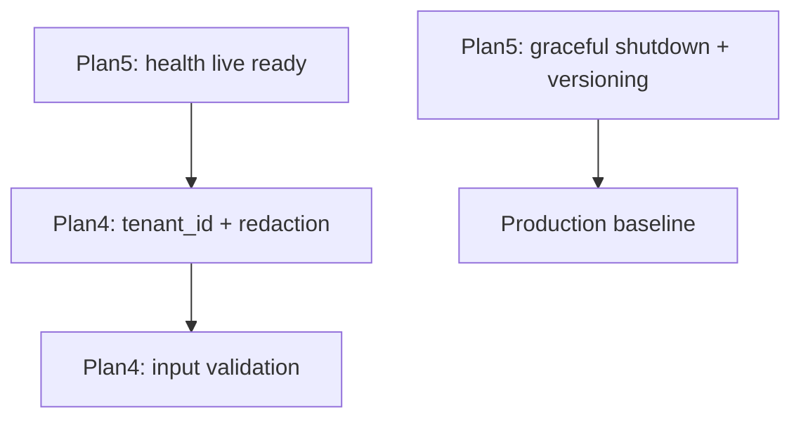

# Production Readiness — 5 planuri

## Starea actuală

| Pilon | Ce există | Ce lipsește |
|---|---|---|
| Evaluări | extras în planul separat „Evaluări RAG + CI/CD" | — (vezi planul dedicat) |
| Reziliență | circuit breaker Ollama, rate limiting slowapi, ingest queue ARQ/Redis (implementat) | — |
| Securitate | validare Pydantic minimă în [`schemas.py`](src/legal_ai/api/schemas.py) | tenant_id, filtrare obligatorie, redactare PII în loguri |
| Deploy | `/health` basic în [`main.py`](src/legal_ai/api/main.py), Docker Compose | readiness/liveness, graceful shutdown, versionare |



---

## Plan 4 — Securitate

**Obiectiv:** validare input, izolare documente per tenant (pregătire JWT), zero PII în loguri. **Auth JWT/OAuth — fază ulterioară** (conform deciziei tale).

### 4a. Tenant isolation (fundație, fără JWT)

- Câmp `tenant_id` în payload Qdrant — [`vector_store.py`](src/legal_ai/retrieval/vector_store.py) `_build_payload`, index KEYWORD pe `tenant_id`
- [`Chunk`](src/legal_ai/ingestion/chunker.py) + [`IngestionPipeline`](src/legal_ai/ingestion/pipeline.py): propagă `tenant_id`
- Toate căutările: filtru obligatoriu `tenant_id` (niciodată query global fără tenant)
- API: header `X-Tenant-ID` obligatoriu (temporar, până la JWT); dependency `get_tenant_id()` în [`dependencies.py`](src/legal_ai/api/dependencies.py)
- Placeholder `src/legal_ai/api/auth.py` cu `get_current_tenant()` — acum citește header, ulterior JWT claims

### 4b. Validare input

- [`schemas.py`](src/legal_ai/api/schemas.py): `question` — strip, max length, blocare pattern-uri injection (`ignore previous`, `system:`, etc.) — listă configurabilă
- Upload PDF: validare magic bytes `%PDF`, nu doar extensie
- `document_ids` — regex/format validation, max items

### 4c. Fără PII în loguri

- Modul `src/legal_ai/security/redaction.py`:
  - regex email, telefon, CNP-like, IBAN
  - `redact(text) -> str` aplicat în logging middleware și în orice log care atinge user input
- Policy: nu loga `question`, `answer`, `chunk.text` la INFO; doar la DEBUG cu redactare + feature flag `LOG_SENSITIVE_DEBUG=false`

### 4d. Prompt injection (guardrail light)

- Pre-check pe `question` înainte de retrieval: scor simplu pe pattern-uri + lungime anormală
- Respinge cu 400 dacă scor > prag; loghează eveniment fără conținut brut

### Migrare date existente

- Script one-shot: reindex cu `tenant_id=default` pentru chunks existente în Qdrant

---

## Plan 5 — Deploy

**Obiectiv:** health checks complete, shutdown curat, versionare prompturi/modele, container production-grade.

### 5a. Health checks

Extinde [`HealthResponse`](src/legal_ai/api/schemas.py) și endpoints:

| Endpoint | Scop |
|---|---|
| `GET /health` | status agregat (existent, îmbunătățit) |
| `GET /live` | proces up — fără dependențe externe |
| `GET /ready` | Qdrant + Ollama + Redis (dacă queue activ) + embedder loaded |

Include în response: `app_version`, `prompt_version`, `embedding_model`, `llm_model`, `build_sha` (env `GIT_SHA`)

### 5b. Graceful shutdown

În [`lifespan`](src/legal_ai/api/main.py):
- semnal oprire: nu accepta joburi noi ingest
- `OllamaClient.close()`, oprire worker ARQ, flush OTEL exporter
- timeout 30s pentru request-uri în curs
- uvicorn: `--timeout-graceful-shutdown 30` în Dockerfile CMD

### 5c. Versionare prompturi și modele

- Fișier `prompts/manifest.yaml`:

```yaml
version: "1.0.0"
prompts:
  qa_system: { file: qa_system.md, hash: sha256:... }
  risk_system: { file: risk_system.md, hash: sha256:... }
```

- [`load_prompt()`](src/legal_ai/inference/llm_client.py): citește manifest, loghează `prompt_version` la startup
- Settings: `PROMPT_VERSION` override env; health returnează versiunea activă
- Modele: `MODEL_MANIFEST_PATH` sau env `LLM_MODEL` + `EMBEDDING_MODEL` (deja în settings) — snapshot în fiecare span OTEL

### 5d. Docker / Compose

[`Dockerfile`](Dockerfile):
- multi-stage build (builder + runtime slim)
- user non-root `appuser`
- `HEALTHCHECK` pe `/live`

[`docker-compose.yml`](docker-compose.yml):
- `healthcheck` pe api, qdrant, redis
- `depends_on: condition: service_healthy`
- serviciu `worker` pentru ingest queue

### 5e. README / runbook

- Secțiune deploy: variabile obligatorii, ordine pornire, rollback prompt version

---

## Ordine recomandată de implementare



1. **Deploy** (health live/ready, versioning) — fundație operațională rapidă
2. **Securitate** (tenant + redaction, fără JWT)

> Plan 1 (Observabilitate — OpenTelemetry) și Plan 3 (Reziliență) au fost implementate și eliminate din acest plan. Plan 2 (Evaluări RAG) a fost extras în planul separat „Evaluări RAG + CI/CD".

## Fișiere principale afectate

- [`src/legal_ai/api/main.py`](src/legal_ai/api/main.py) — middleware, endpoints noi
- [`src/legal_ai/config/settings.py`](src/legal_ai/config/settings.py) — toate env-urile noi
- [`src/legal_ai/inference/llm_client.py`](src/legal_ai/inference/llm_client.py) — tokens + circuit breaker
- [`src/legal_ai/retrieval/vector_store.py`](src/legal_ai/retrieval/vector_store.py) — tenant filter
- [`docker-compose.yml`](docker-compose.yml) — redis, worker, healthchecks
- [`pyproject.toml`](pyproject.toml) — dependențe OTEL, ARQ, slowapi

## În afara scope-ului (fază ulterioară)

- JWT/OAuth și mapare claims → `tenant_id`
- Langfuse (poate complementa OTEL pentru UI LLM dacă e nevoie)
- Kubernetes manifests / Helm
